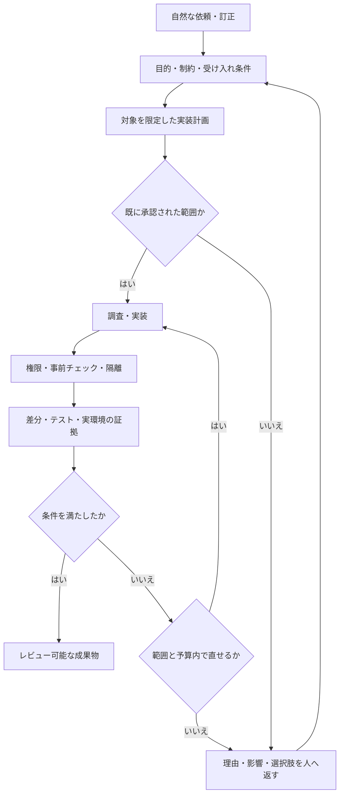

# 設計全体

状態：設計版。公式仕様の確認日：2026年10月7日。対象：ソフトウェア開発。

## 目的と成功条件

ユーザーの自然な依頼を、実装で確認できる目的・制約・受け入れ条件に結び付ける。実装の細部は任せられても、製品の意味、外部仕様、権限、公開範囲を勝手に変えない運用にする。

成功は「指示ファイルが増えた」「テストがたくさん通った」で判断しない。実際の代表作業で、認識の修正に要した時間、範囲外変更、未確認を完了と報告した件数、検証の妥当性を確認する。改善率は計測するまで記載しない。

## 問題を分解する

| 症状 | 確認すべき原因 | 対応 |
| --- | --- | --- |
| 思っていたものと違う | 目的と具体例が作業に残っているか | 元の言葉を残した合意と受け入れ例 |
| 会話途中で認識がずれる | 古い判断、要約、別作業が混ざったか | 判断台帳と作業ごとの引き継ぎ |
| 設計を善意で変える | 任せた細部と、人へ戻す判断の境界があるか | 変更範囲・不変条件・例外申請 |
| 無人実行が抜け穴だらけ | シェル・MCP・設定の変更経路が残っているか | 外部の権限制御・隔離・終了判定 |
| 指示が長いのに守られない | 常時読み込みが過密か、制約が競合するか | 短い常設指示と必要時読み込み |

モデルの能力差は検証対象とする。「Claudeはニュアンスを理解できない」を前提に設計しない。現場の具体例で、どの層が改善に寄与したかを確かめる。

## 四つの層

これは内部の責務分担であり、利用者が毎回選ぶ操作メニューではない。日常の入口は自然な会話とし、必須導入・任意の補助・無人運用の境界を[利用境界](USAGE-BOUNDARIES.md)に定義する。kitは配布用の構成、スキルは任意の手順、ハーネスは実行制御として区別する。

1. 意図：短いCLAUDE.md、プロジェクト概要、判断台帳。
2. 作業：場面別スキル、作業合意、必要な仕様への参照。
3. 実行：権限設定、フック、隔離環境、外部の承認管理。
4. 証拠：変更差分、受け入れ条件への対応、検証結果、人のレビュー。

公式のCLAUDE.md・メモリは強制設定ではなく文脈として扱われる。[記憶の公式仕様](https://code.claude.com/docs/en/memory)。このため層1・2だけで層3・4の代わりにはしない。

## 意図を保つ合意

作業合意は、ユーザーの発言の置き換えではなく、その意味を実装まで運ぶ記録とする。

- 原文：重要な依頼と訂正を短く残す。
- 解釈：期待する振る舞いを具体例にする。
- 不変条件：既存API、データ保持、認証方式など守る条件。
- 許可範囲：対象ファイル・操作・実行環境。
- 受け入れ条件：観察できる結果と確認方法。
- 未決事項：推測では埋められない項目。
- 承認：何を、どの版について、誰が承認したか。

「いい感じにして」は外観の軽微な調整を任せる根拠にはなっても、データ送信や仕様変更の根拠にはしない。既に承認された通常の編集は繰り返し確認しない。

## 作業の状態

| 状態 | できること | 次へ進む条件 |
| --- | --- | --- |
| 相談 | 仮説・代替案・質問 | 調査対象が決まる |
| 調査 | 承認範囲の参照、現状と矛盾の整理 | 実装の根拠と不明点が分かる |
| 合意待ち | 計画と影響の提示 | 必要な実装承認が得られる |
| 実装中 | 承認範囲で編集と許可された検証 | 差分と条件の照合へ進める |
| 例外待ち | 独立して進められる作業のみ | 範囲・仕様・予算の変更が承認される |
| 検証中 | 証拠取得と範囲内の修正 | 条件が成立、または未完理由が確定 |
| レビュー待ち | 結果・差分・制約の提示 | 人が受け入れる |
| 完了・中止 | 記録と引き継ぎ | 新しい依頼が来る |

合意ファイルの状態欄は補助記録であり、権限付与ではない。Claudeが`approved`と書くだけで実行を解放する構造は禁止する。

## 大きなプロジェクトへの適用

全体の不変条件と、現在の小さな作業合意を分ける。機能の縦の経路で分割し、1作業に入出力・失敗時の状態・確認方法を含める。単にファイル単位で分割して結合の問題を後回しにしない。

最初に既存の仕様・指示・ビルド構成・未コミット変更を確認する。矛盾がある場合は該当箇所と影響を提示し、その判断に依存しない調査を継続する。全資料を一括で読ませることは避ける。

インターフェース変更、移行、認証・認可、並行処理などは先に境界を設計する。実装の各区切りで不変条件を照合し、最後に結合・利用場面を確認する。

## 段階導入

初期は既存指示に必要な方針を統合し、通常の会話から監督付きで使う。大きな作業の合意、特定場面のスキル、権限設定の変更は必要時だけ追加する。次に必要性が確認された場合にフックと差分照合を実装・試験する。無人実行は外部の起動検査と隔離環境が成立してから解放する。[実装順序](ROADMAP.md)と[ハーネス仕様](HARNESS.md)を参照。

この設計は新規製品への拡張を目的としない。業務の修正・レビュー負担を減らすための小さな共通キットとして検証し、主力プロダクトの作業を止める大規模研究にしない。
